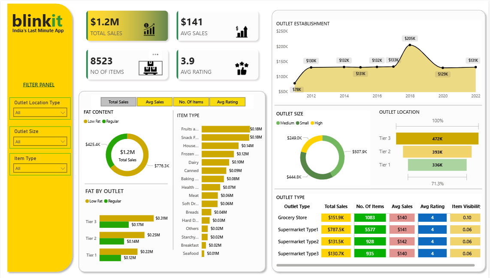

## 🛒 Blinkit Sales Analytics Dashboard

An interactive Power BI dashboard analyzing Blinkit’s sales performance, customer satisfaction, and outlet-level distribution to uncover revenue drivers, product trends, and optimization opportunities.

---

## 📸 Dashboard Preview

---

## 🎯 Project Objective

The objective of this project is to analyze Blinkit’s retail sales data to:

* Evaluate overall sales performance and revenue trends
* Understand the impact of **fat content** on product sales
* Identify high-performing **item categories**
* Analyze outlet performance by **size, type, location, and establishment year**
* Assess customer satisfaction using ratings
* Support data-driven decisions for inventory, pricing, and expansion strategies

---

## 🧠 Business Problem

Blinkit operates across multiple outlet types and locations with a wide variety of grocery items. Business stakeholders often face challenges in answering questions such as:

* Does **fat content** (Low Fat vs Regular) influence total sales?
* Which **item types** generate the highest revenue?
* How do **outlet size and location** impact sales performance?
* Are newer or older outlets performing better?
* How do customer ratings correlate with sales?

Raw transactional data makes it difficult to extract these insights without a centralized analytical view.
This dashboard converts complex data into **clear, actionable business insights**.

---

## 🛠 Tech Stack

* **Power BI Desktop** – Data visualization and dashboard development
* **Power Query** – Data cleaning and transformation
* **DAX (Data Analysis Expressions)** – KPI calculations and dynamic measures
* **Data Structure** – Single flat retail sales table
* **File Formats** – `.pbix` (development), `.png` (dashboard preview)

---

## 📂 Data Source

**Source:** Practice Blinkit retail sales dataset

The dataset includes:

* Item type and fat content
* Total sales and average sales
* Number of items sold
* Customer ratings
* Outlet size, type, and location
* Outlet establishment year
* Item visibility

This structure enables analysis across **product performance, outlet behavior, and customer satisfaction**.

---

## 📊 Key Metrics

* **Total Sales:** $1.2M
* **Average Sales:** $141
* **Number of Items Sold:** 8,523
* **Average Customer Rating:** 3.9

---

## 📈 Dashboard Walkthrough

### 🔹 Interactive Filters & Slicers

* Outlet Location Type
* Outlet Size
* Item Type

(All visuals update dynamically based on selections)

---

### 🔹 Total Sales by Fat Content (Donut Chart)

* Compares **Low Fat vs Regular** products
* Highlights how fat content influences total sales contribution

---

### 🔹 Total Sales by Item Type (Bar Chart)

* Identifies top-performing product categories such as Fruits & Vegetables, Snacks, Dairy, Household items, etc.
* Helps prioritize high-revenue items

---

### 🔹 Fat Content by Outlet (Bar Chart)

* Compares total sales across **Tier 1, Tier 2, and Tier 3 outlets** segmented by fat content

---

### 🔹 Total Sales by Outlet Establishment (Area Chart)

* Shows sales trends based on outlet establishment year
* Helps evaluate outlet maturity vs performance

---

### 🔹 Percentage of Sales by Outlet Size (Donut Chart)

* Analyzes sales contribution by **Small, Medium, and High** outlet sizes
* Medium-sized outlets generate the highest sales share

---

### 🔹 Sales by Outlet Location (Funnel)

* Compares sales across **Tier 1, Tier 2, and Tier 3** locations
* Tier 3 locations show the highest sales contribution

---

### 🔹 All Metrics by Outlet Type (Table)

Provides a consolidated comparison of:

* Total Sales
* Number of Items
* Average Sales
* Average Rating
* Item Visibility

Across:

* Grocery Stores
* Supermarket Type 1
* Supermarket Type 2
* Supermarket Type 3

---

## 💡 Business Insights

* Low-fat products contribute more to total sales than regular-fat products
* Fruits & Vegetables and Snack categories drive the highest revenue
* Medium-sized outlets outperform small and high-sized outlets
* Tier 3 locations generate the highest overall sales
* Customer ratings remain consistent across outlet types

---

## 📌 Key Takeaways

* Enables clear understanding of product and outlet performance
* Helps optimize inventory distribution based on outlet size and location

---

## 🚀 How to Use

* Download the `.pbix` file from the repository
* Open it using **Power BI Desktop**
* Use slicers to explore insights across outlet and product dimensions

---

##  Why This Project Matters?

This project demonstrates:

* Strong business analytics and problem-solving skills
* Ability to translate retail data into actionable insights
* Proficiency in Power BI, Power Query, and DAX

---
